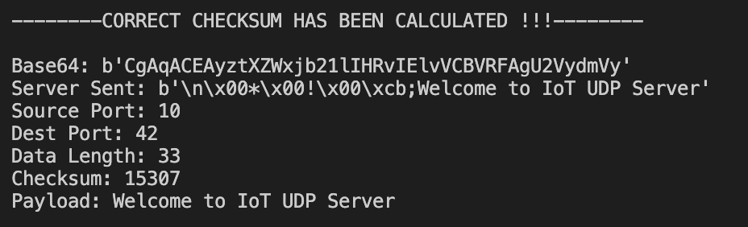
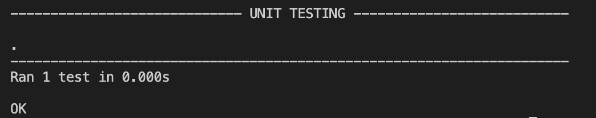

# **User Datagram Protocol (UDP)**

## 🚀 **Getting Started**

This repository contains python module that uses User Datagram Protocol to send out requests to a server and can expect to receive one or more responses. The server waits for incoming UDP packets on a specified port, and the client sends UDP packets to the server on the same port. 

The Base64 algorithm generates strings that are safe to transport between any two computers that implement the Base64 algorithm. Base64 is a binary to text encoding technique. Firstly, the text to be encoded is converted to the corresponding decimal value in accordance with the ASCII table; next, the newly obtained decimal value is converted to its binary equivalent. All of the equivalent binary numbers are concatenated to obtain a large number of binary numbers; then, the entire set of binary numbers is divided into equal parts, each containing only 6 bytes. The equal set of 6 bytes is converted Base64 decoding which is the opposite of Base64 encoding; it is accomplished by carrying out the encoding procedures backwards.

### **UDP Packet Format**
A UDP packet is made up of a header and a data seciton (the payload).The header, 8 bytes in size, consists of 4 fields, each 2 bytes, and is defined as:

- The port on the machine sending the data is called the **source port**. If the destination computer doesn't need to respond to the sender, this field can be set to zero.
- Port that will receive the data is called the **destination port**. The range of UDP port numbers is 0 to 65,535.
- **Length** indicates how many bytes make up the UDP payload data and header. The underlying IP protocol used to transport the data sets the limit for the UDP length field.
- To enable use with servers other than the Base64-encoded UDP defaults, a **checksum calculator** was created. The checksum starts at 0 and is then converted into an integer while indicating the binary values of the ports and payload using the bytes. These binary numbers are summed after their combination, and the One's complement of this sum is then determined. A checksum calculator makes sure there are no transmission errors. 

## 🖥️ **How to Run**
0. Ensure you have [python3](https://www.python.org/download/releases/3.0/) installed.
   
   At a command prompt, type `python --version` to ensure you have version 3.
0. Also ensure you have base64, struct and time imported.
1. Download or clone this repository.
   
   If you download as a zip file, be sure to unzip it.
2. Run udp.py to talk to server.

## 🎯 **Features**

**Receving and decoding packet:** Basic client to receive message from the UDP server and decode it, without error‐checking.

**Validating checksum:** Checking if packet is valid with comparing checksum from received packet against to checksum supplied in packet header.

**Sending and receiving UDP packet from server:** Sending a valued UDP packet to the server, with the payload 1111, and waiting to receive the time back, and then sleeping for 1 sec and repeating.

## 🖇️ **Example Usage**

📍 Udp.py

## 💡 **Unit Testing**
📍 Udpunit.py

Program has a unit testing to checksum validation:

Assert Function | Checksum validation | Output |Comparison | Pass/Fail
-------------   | ------------- | ------------- | ------------- | ------------- | 
assertEqual() | 10, 42, Welcome to IoT UDP Server | 15307 | True, payload is correct | Pass
assertEqual() | 5678,1234, hello| 1234, 5678, hello |True, sum of source and destination ports are the same | Pass
assertNotEqual() | 10,42, Welcome to the Server | 15307 | False, payload is not correct | Pass
assertNotEqual() | 1234,5678, hello | 5688, 1234, hello | False, sum of source and destination ports are not same | Pass

After running all tests expected output:

## 📚 **Library** 
Here is the library for unit testing: [unittest](https://docs.python.org/3/library/unittest.html)

## 📪 **Installation** 
1. If you do not have [websocket](https://pypi.org/project/websocket-client/) installed: 
   
   At a command prompt, type `python3 setup.py install` or `pip3 install websocket-client` to install.

2. If you do not have [base64](https://pypi.org/project/pybase64/) installed: 
   
   At a command prompt, type `pip install pybase64` to install.
3. If you do not have [struct](https://pypi.org/project/supyr-struct/) installed: 
   
   At a command prompt, type `python3 -m pip install supyr_struct` to install.

## 🤓 **Maintainers** 
Sude Fidan(@sudefidan)

## 📖  **Referencing** 
* https://www.imperva.com/learn/ddos/udp-user-datagram-protocol/
* https://www.fortinet.com/resources/cyberglossary/user-datagram-protocol-udp
* https://en.wikipedia.org/wiki/User_Datagram_Protocol
